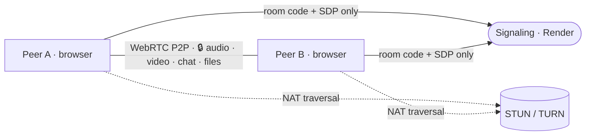

<div align="center">

# Omni

### Private calls. No middleman.

Browser-to-browser **end-to-end encrypted** video, voice, chat &amp; file sharing.
Your media travels **directly** between browsers — the server is architecturally blind to it.

[](#-license)
[](#-development)
[](#-tech-stack)
[](#-progressive-web-app)
[](#-how-it-works)
[](#-encryption)

</div>

> **No accounts. No installs. No trace.** One person creates a room, shares a short code
> (or a QR), the other joins — and a direct, encrypted channel opens between the two browsers.
> The server only ever relays room codes and opaque connection handshakes.

---

## ✨ Features

### 🔐 Private by design
- **End-to-end encrypted** — ECDH P-256 key exchange → HKDF → AES-GCM-256, layered on top of WebRTC's built-in DTLS
- **Server-blind** — the signaling server only sees room codes and opaque SDP/ICE blobs; it *cannot* read your calls, chat, or files
- **Safety-number verification** — compare a short emoji + code (SAS) out loud to rule out a man-in-the-middle
- **Optional room password** — folded into key derivation, so peers with different passwords simply can't connect

### 📞 Calls &amp; sharing
- **P2P video &amp; voice** — direct browser-to-browser, no media server in the path
- **Flip camera** — front/back switch, right in the main controls
- **Screen sharing** — one tap on desktop, graceful fallback on mobile
- **Picture-in-Picture** — pop the call out; auto-enters when you switch tabs
- **Local recording** — composite the call to a `.webm` saved on *your* device (nothing uploaded)
- **Encrypted chat** — real-time messaging over the DataChannel, with a typing indicator
- **File transfer** — chunked, encrypted, SHA-256-verified, multi-file queue, drag-drop &amp; paste to send

### 🎨 Crafted experience
- **Material / pastel UI** — clean line icons and frosted, circular controls
- **Immersive auto-hide** — controls fade away after a few seconds and reveal on tap
- **Tap-to-swap** — tap your self-view to go full-screen; your peer shrinks to a draggable thumbnail
- **Draggable picture-in-picture** — fling the small window to any corner; it snaps and stays clear of the controls
- **Tidy overflow menu** — secondary actions tuck into a "More" dropdown
- **Dark &amp; light themes** — warm-orange dark mode and fresh-green light mode, remembered across sessions
- **Live feedback** — connection-quality badge, call timer, mic level meter, and a "you're muted" nudge
- **Notification sounds** — subtle Web Audio tones on join, message, and hangup

### 🌍 Global &amp; accessible
- **5 languages** — English, Español, Français, Deutsch, हिन्दी (auto-detected, switchable)
- **Installable PWA** — Add to Home Screen for a chrome-free, native-app feel
- **Built for a11y** — semantic roles, ARIA labels, live regions, and keyboard support

---

## 🧠 How it works



| Piece | Role | Sees your data? |
|---|---|---|
| **GitHub Pages** | Serves the static frontend (HTML/CSS/JS) | No |
| **Render** | WebSocket signaling — room codes + SDP/ICE relay | No |
| **Google STUN** | Helps peers discover their public IP/port | No |
| **Metered.ca TURN** | Encrypted relay fallback for strict NATs (~15% of users) | Encrypted only |
| **The two browsers** | All audio, video, chat &amp; files — direct &amp; encrypted | **Yes — only here** |

### 🔐 Encryption

Two independent layers protect every byte:

| Layer | Scope | Keys controlled by |
|---|---|---|
| **DTLS** | Transport (built into WebRTC) | Browser, automatic |
| **AES-GCM-256** | Application (this app) | Peers only, ECDH-derived |

```
ECDH(yourPrivate, theirPublic)
  → shared secret
  → HKDF-SHA-256 ( + optional room password )
  → AES-GCM-256 session key
```

Both peers derive the same key independently. The server never sees any key material.

---

## 🚀 Quick start

> Want the 10,000-ft tour of the architecture and module contracts? See [CONTEXT.md](CONTEXT.md).

**1. Clone**

```bash
git clone https://github.com/yourusername/omni
cd omni
```

**2. Deploy the signaling server** (Render free tier) and note its URL: `wss://your-app.onrender.com`

**3. Get free TURN credentials** at [metered.ca](https://www.metered.ca/stun-turn) — copy the `username` and `credential`.

**4. Configure the client** — edit [`js/config.js`](js/config.js):

```js
export const CONFIG = {
  SIGNALING_URL: 'wss://your-app.onrender.com',   // ← your Render URL
  ICE_SERVERS: [
    { urls: 'stun:stun.l.google.com:19302' },
    {
      urls: 'turn:global.relay.metered.ca:80',
      username: 'YOUR_USERNAME',                  // ← from metered.ca
      credential: 'YOUR_CREDENTIAL',
    },
    // …keep the other TURN entries with the same credentials
  ],
};
```

**5. Deploy the frontend** — push to `main`; CI publishes to GitHub Pages automatically
(**Settings → Pages → Source: GitHub Actions**).

---

## 🧪 Development

```bash
# Terminal 1 — signaling server
cd server && npm install && node --watch index.js     # → listening on :8080

# Terminal 2 — serve the frontend over HTTPS (required for camera/mic)
npx serve .                                            # or VS Code Live Server / ngrok
```

For local dev, point `SIGNALING_URL` in [`js/config.js`](js/config.js) at `ws://localhost:8080`.

**Run the test suite** — 119 tests across 8 files, powered by Node's built-in `node:test` (zero frameworks):

```bash
cd tests && npm install && npm test
# tests 119 · pass 119 · fail 0
```

---

## 📱 Progressive Web App

Install Omni straight from the browser ("Add to Home Screen") for a full-screen, native-app feel.

- 🌙 **Dark** (default) — warm orange accent on near-black
- ☀️ **Light** — fresh green accent on soft white
- Toggle from the home screen; your choice persists. Assets are cached by the service worker for instant loads.

---

## 🗂️ Project structure

```
omni/
├── index.html              # App shell — home · lobby · call screens, CSP, PWA meta
├── manifest.json           # PWA manifest (standalone, installable)
├── sw.js                   # Service worker — offline caching, /omni scope
├── deploy.yml              # CI: publish frontend to GitHub Pages
├── css/
│   └── styles.css          # Dual-theme styling, material controls, responsive
├── js/
│   ├── config.js           # ← Edit: signaling URL + TURN credentials
│   ├── app.js              # UI state machine — orchestrates every feature
│   ├── boot.js             # Theme toggle + service-worker registration
│   ├── signaling.js        # WebSocket client (reconnection + timeout)
│   ├── webrtc.js           # RTCPeerConnection + DataChannel + file transfer
│   ├── crypto.js           # ECDH + AES-GCM + SHA-256 (Web Crypto API)
│   ├── recorder.js         # CallRecorder — canvas compositor + mixed audio → .webm
│   ├── qrcode.js           # Vendored QR generator for share links
│   ├── i18n.js             # 5-language translation layer
│   └── sounds.js           # Web Audio notification tones + quality calc
├── server/
│   ├── index.js            # WebSocket signaling server (~210 lines)
│   ├── package.json        # Single dependency: ws
│   ├── Dockerfile
│   └── render.yaml         # Render deployment blueprint
├── tests/                  # 119 tests · node:test
│   ├── crypto.test.js      # 18 · key exchange, encrypt/decrypt, hashing
│   ├── server.test.js      # 17 · room lifecycle, rejoin, sanitisation
│   ├── integration.test.js #  7 · full signaling flow
│   ├── quality.test.js     # 17 · connection-quality thresholds
│   ├── filequeue.test.js   #  7 · sequential file queue
│   ├── e2e.test.js         # 19 · incremental hash, transfer, glare, hardening
│   ├── features.test.js    # 13 · SAS, room password, multiplexed files, QR
│   └── i18n.test.js        # 21 · translation completeness + HTML contract
├── CONTEXT.md              # Architecture &amp; module contracts (deep dive)
└── README.md
```

---

## 🛡️ Security

| Threat | Mitigation |
|---|---|
| Server reads your call | It only sees opaque SDP/ICE blobs — DTLS + AES-GCM protect all media &amp; data |
| Man-in-the-middle | DTLS fingerprints verified by WebRTC, plus an out-of-band safety-number (SAS) check |
| File tampering | SHA-256 checksum verified on every received file |
| Room-code brute force | Codes are short-lived and expire when the room empties |
| Replay attacks | Every AES-GCM message uses a unique nonce |
| Untrusted input | Room codes sanitised server-side; strict Content-Security-Policy on the client |

---

## 🧩 Tech stack

- **Vanilla JS, ES modules** — no framework, no bundler, no build step
- **WebRTC** — browser-native P2P audio/video/data
- **Web Crypto API** — native ECDH + AES-GCM + SHA-256, no crypto libraries
- **Web Audio API** — notification tones generated on the fly
- **WebSockets** (`ws`) — signaling only
- **Service Worker** — offline caching for the PWA
- **Render** · **GitHub Pages** · **Metered.ca** — signaling, hosting &amp; TURN, all on free tiers

---

## 🤝 Contributing

PRs welcome — the codebase is intentionally small and dependency-light. No build step: edit a file, refresh the browser. Please keep the test suite green (`cd tests && npm test`).

---

## 📜 License

[MIT](#-license) — built with care by **Vijesh Gowda**.
